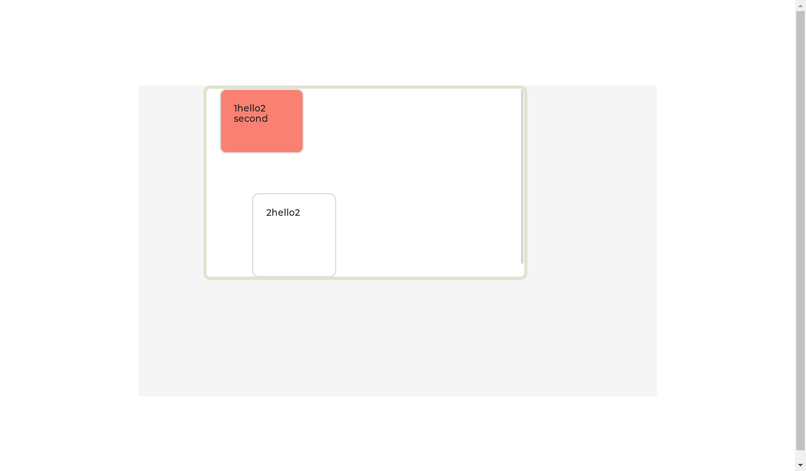
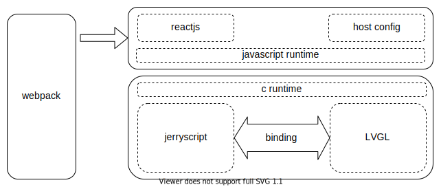

# Quickgl

Quickgl is project for empowering LVGL with React. Our goal is using LVGL and reactjs to quickly build UI in embeded devices.

## Simulate

currently you can compile code to wasm, and simulate, I create a [repo](https://github.com/lee88688/react-webpack-typescript-starter) for this.
you can create this



by jsx
```jsx
// App.tsx
import React, {useEffect, useState} from 'react';
import styles from './index.lv.css';

export default function App() {
  const [cnt, setCnt] = useState(0);


  return (
    <obj className={styles.s1} onClicked={() => setCnt(cnt + 1)}>
      {/* <obj className={styles.s3}></obj> */}
      <obj className={styles.s3}>
        {`1hello${cnt}\nsecond`}
      </obj>
      <obj className={styles.s2}>{`2hello${cnt}`}</obj>
    </obj>
  );
}
```

and css

```css
/* index.lv.css */
.s1 {
  left: 100px;
  top: 0px;
  width: 500px;
  height: 300px;
  display: flex;
  flex-direction: column;
  padding-top: 0px;
  border-color: rgb(226, 226, 208);
  border-width: 5px;
}

.s2 {
  left: 50%;
  transform: translate(50px, 50px);
}

.s3 {
  height: 100px;
  background-color: salmon;
}
```

## Framework
